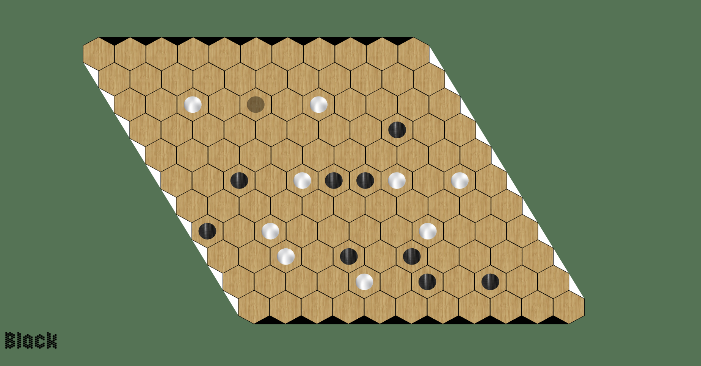
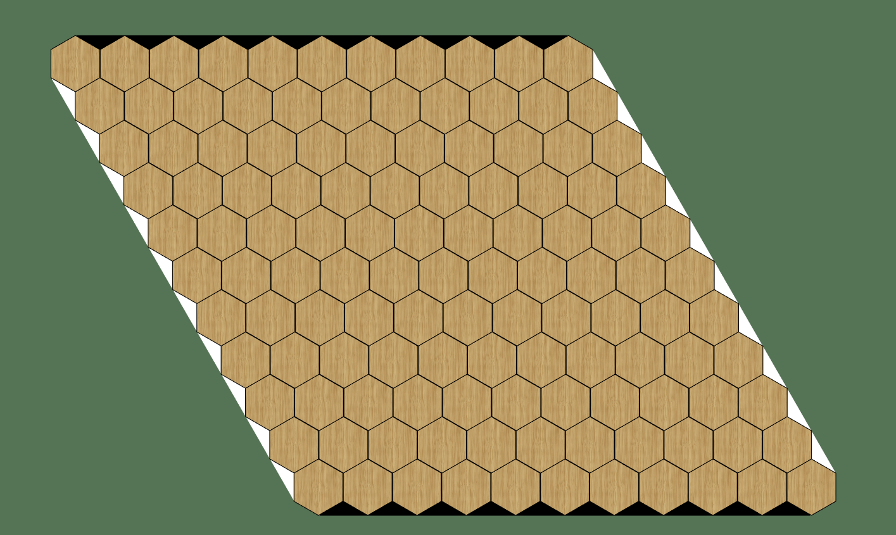
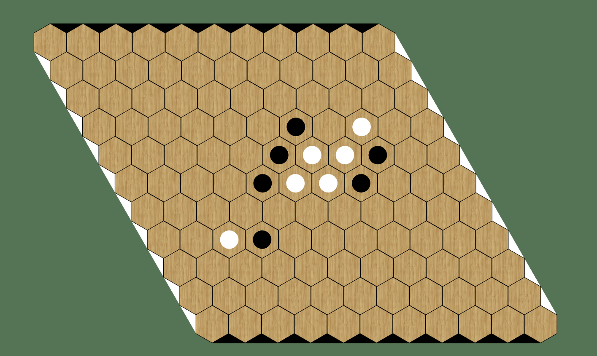
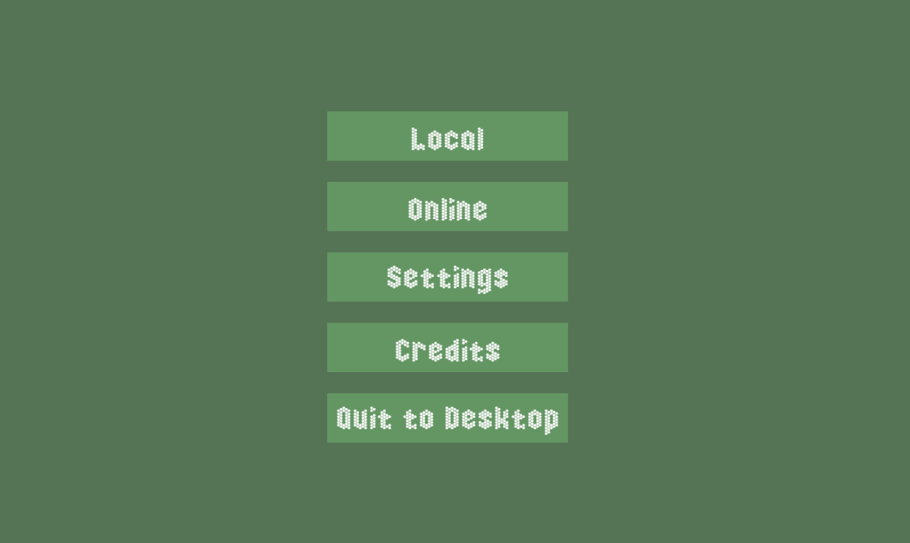
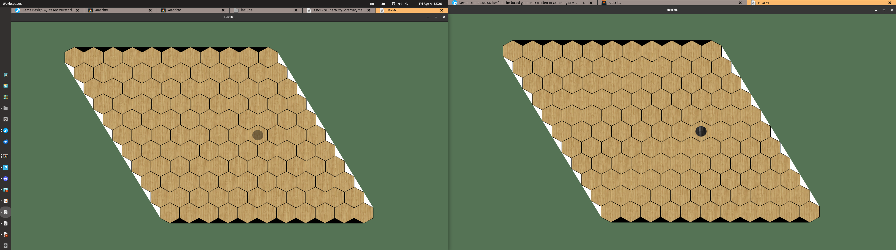

# HexFML

[Hex](https://en.wikipedia.org/wiki/Hex_(board_game)) is a finite, 2-player perfect information game, and an abstract strategy game. Players attempt to connect opposite sides of a (traditionally) 11x11 rhombus-shaped board made of hexagonal cells. This an application where you can play Hex written in C++ using SFML.

The etymology behind HexFML has nothing to do with the acronym fml and it's meaning that you may or may not know (but it would reflect my dev experience throughout this learning experience). The name is derived from Hex + SFML and combined into HexFML. I really enjoyed my combinatorial game theory class this semester and I want to explore C++ applications such as embedded and game dev, so I decided to recreate the board game Hex. This was one of the games we studied in class and my prof's "addiction", so it seemed like a suitable candidate. 

Disclaimer: This is by no means an analysis of Hex and certainly the messiest code C++ code me or anyone else has ever written.

There are many areas of the code that are disorganized, as well as some code that I learned how to organize better throughout the process (such as encapsulating sounds in their own class). I was unfamiliar with C++ and this was an invaluable learning experience and I can definitely see why this language is used in production. Of course, I still need to practice quite a bit, but it was really cool feeling the difference in productivity between C and C++, which was to be expected with dabbling into graphical libraries and game dev. 

Something I totally forgot about until after most of this project was done is [Google's C++ style guide](https://google.github.io/styleguide/cppguide.html) which definitely could've helped me in keeping my code organized rather than the let's call it "functional" approach I took. So as a reference for future projects I will embed that link here. 

## Learning outcomes
- C++
- Game development
- Networking (sockets)

## Hex board

I am definitely not a front end dev and doing this project only proves to me that if I were to ever want to do front end, I'd need a lot more practice. The hex board code is atrocious and I hope it does not set the precedent for the game and networking code. Even with all this negative talk, I am at least extremely happy with how the board came out. I think in terms of purely aesthetics, it looks pretty great. I do not envy the developer that will have to maintain the code. Oh wait.

## Pieces

What a euphoric feeling when the piece snaps right into place.

## Depth First Search (DFS)

To automatically determine when there is a winner, we treat the board like a graph and perform the DFS graph traversal algorithm. A fun application of what I learned in Applied Graph Theory last semester. 

## Completed game for local play

Several types of menus, some sounds effects, textures, and lots of refinement later... I think I have a "complete" game where people can now play this locally and it seems to work pretty well. I've got music and sound sliders that persist, a pause menu, and the gameplay which has been functional for a while. I'm very happy with how it has turned out so far. But I do have a feeling that getting into the networking and making this game online compatible will be the most challenging part.

## Online

Now it's time for what I anticipated to be the most challenging part, which seems daunting since everything leading up to this point was a struggle. I want to implement Peer-to-Peer capabilities where players will either be able to host/join games with people using their IP address. This will use SFML's sockets from their networking library, and I am thankful that I have played around with sockets and networking before so this is at least not completely new to me. 

The first iteration of online. Incredibly buggy and unpolished, but functional! I tested this using loopback (127.0.0.1), so who knows how it would behave if I were playing with someone outside of my network, but that's what first iterations are for. 

## Build

This will be tested later on other platforms. Development was done on PopOS which is based on Ubuntu 22.04. The only package I did not have previously that I had to download was libsfml-dev.

`sudo apt install libsfml-dev`

A Makefile is included if you wish git clone and compile.

`make` to compile and link the libraries.

`make clean` to clean up the bin and obj files.

`./bin/hex++` to execute the program.

## To-do
- Fix turnText for online
- Fix displayWinner for online
- Set a "play again" time limit and afk detection
- Add PauseMenu in online
- Add more graceful disconnect
- Fix networking to update win screen on loser's side immediately
- Official release and publish

## Credits
### Music
Composed and performed by Nick Roberts

### Sound effects
- https://opengameart.org/content/different-steps-on-wood-stone-leaves-gravel-and-mud
- https://opengameart.org/content/menu-selection-click

### Textures
- https://opengameart.org/node/21051
- https://www.istockphoto.com/vector/black-metal-texture-background-vector-illustration-gm928819670-254735270
- https://www.istockphoto.com/vector/abstract-gray-and-white-color-gradient-background-vector-illustration-gm1704870086-539106620

### Fonts
- https://www.fontspace.com/honeycomb-happiness-font-f70260. Honeycomb Happiness
